# 遺伝的アルゴリズム

## 0. バスの運転手 (巡回セールスマン問題)

あなたはバスの運転手になりました。これから、近くに住む 4 人の子供たちを迎えに行こうと考えています。なるべく早く全員を乗せるため、もっとも短くなるルートを選びたいです。それぞれの家をまわる順番は何通りあるでしょうか？

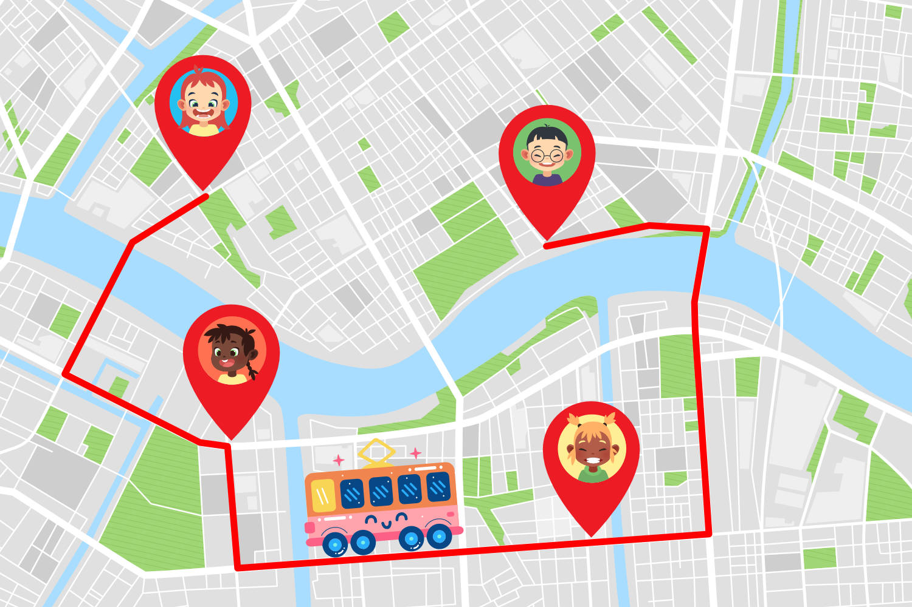

実は、子供たちの名前をそれぞれ A, B, C, D とすると、まわる順番は

- A → B → C → D / B → A → C → D / C → A → B → D / D → A → B → C
- A → B → D → C / B → A → D → C / C → A → D → B / D → A → C → B
- A → C → B → D / B → C → A → D / C → B → A → D / D → B → A → C
- A → C → D → B / B → C → D → A / C → B → D → A / D → B → C → A
- A → D → B → C / B → D → A → C / C → D → A → B / D → C → A → B
- A → D → C → B / B → D → C → A / C → D → B → A / D → C → B → A

のなんと 24 ($4 \times 3 \times 2 \times 1$) 通りもあります。

この数は人数が増えるにつれてどんどん増えていきます。例えば

- 5 人: 120 通り
- 6 人: 720 通り
- 7 人: 5,040 通り

などといった具合です。クラス全員、40 人を全員のせようとすると、その数は

約 800000000000000000000000000000000000000000000000 通り

にも達します。これは、現代のどんなコンピュータを使っても、全く歯が立たないほどの大きさです。このような現象を、**組み合わせ爆発**と呼びます。

## 1. 遺伝的アルゴリズムとは？

遺伝的アルゴリズムは、組み合わせ爆発が起こるような問題の、「もっとも良いとは限らないが、かなり良いと考えられる」答えを得られる方法です。

実は、私たちは、先ほど紹介した 40 人の家をまわるバスの問題をある程度解くことができます。実際に地図に 40 個の点を書いて、「なんとなく」短くなるように線で結べばよいですね。

**遺伝的アルゴリズム**では、この「なんとなく」の部分を、遺伝子の仕組みをコンピュータ上で再現することで実現します。

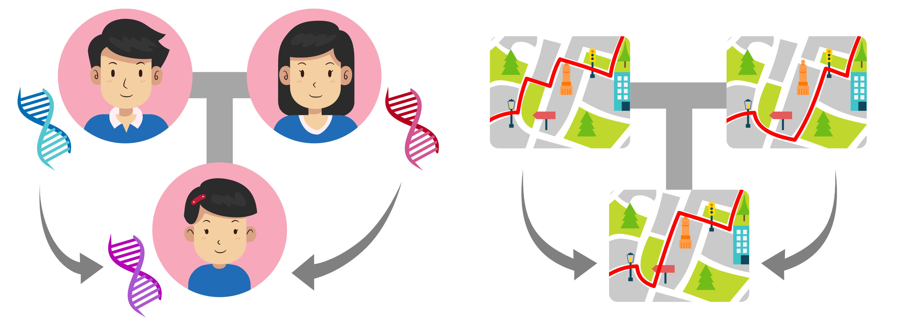

遺伝子とは、生命をかたちづくる設計図のようなものです。私たちの体は皆、この遺伝子に基づいて作り上げられています。

遺伝子は親から子へと受け継がれます。これを **交叉 (こうさ)** と呼びます。皆さんがお父さんやお母さんとそっくりなのは、この交叉の仕組みがあるからなのです。

ところが、生命は完璧ではありません。交叉により新しい遺伝子を生み出す過程で、間違いが起こる場合があります。これが**突然変異**です。突然変異は、悪い結果ばかりをもたらすとは限りません。ときには生命にとって有益な変化が起こることもあります。突然変異は、生命の多様性を育む仕組みといえるでしょう。

地球の長い歴史の中で、より環境に適応した遺伝子を持った個体は生き残り、そうでない個体は死滅 (**自然選択**) します。こうして、生命は環境に順応していくのです。

遺伝的アルゴリズムにおける「遺伝子」とは、解こうとしている問題について考えられる膨大な「答え」の中のひとつです。前章のバスの問題であれば、子供たち全員の家を結んで出来上がるルートが、「遺伝子」にあたります。

## 2. 各部の使い方

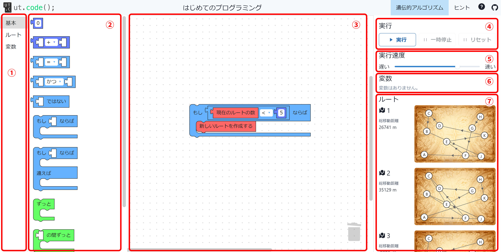

- ① ... ブロックの分類です。クリックすると ② が開きます。
- ② ... ブロック一覧です。③ にドラッグするとブロックを配置できます。また、③ から ① や ② にドラッグするとブロックを削除できます。
- ③ ... 実行されるブロックを配置する場所です。左上のブロックから順番に実行されます。
- ④ ... プログラムの動作を制御します。
- ⑤ ... プログラムの実行速度を変更します。
- ⑥ ... 変数を使う場合、現在使用されている変数と、実行中の変数の値が表示されます。
- ⑦ ... ルート一覧が表示されます。

## 3. 自然選択を実現しよう

まずは画面を見てみましょう。⑦ に表示されている 10 個のルートが、最初の時点での遺伝子にあたるルートです。この中で**総移動距離の短い 5 つのルート**が自然選択により残るようにしてみましょう。

### 3.1. ルートの総移動距離を計算しよう

まずは、それぞれのルートの総移動距離を計算してみましょう。手始めに、最初 (1 番目) のルートの移動距離を計算していきます。

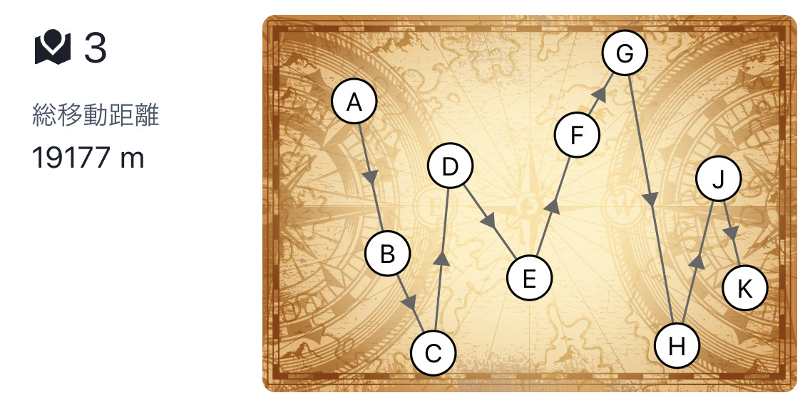

1 番目の地点 (ここでは A 地点) と 2 番目の地点 (ここでは B 地点) の間の距離は、次のようなブロックで求められます。

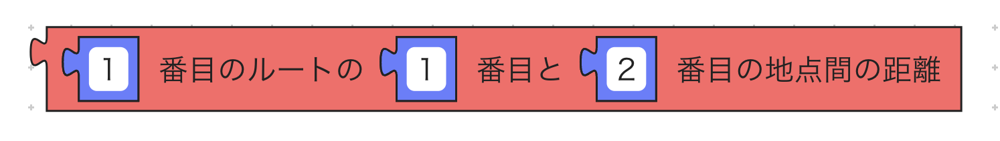

この距離を順番に変数に加えていくことで、合計の距離を求めることができます。

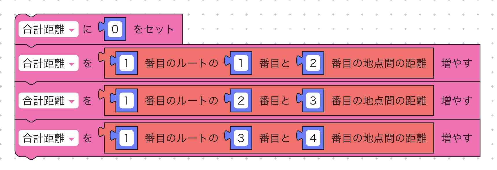

しかし、全部で 10 箇所の地点すべてにこれを行うのは少々面倒です。そこで、繰り返しを用いてシンプルに記述してみましょう。

「合計距離」と「地点番号」変数を作成します。**「地点番号」変数が「地点の数」(10) 以下である**ことを条件に、「地点番号」を 1 ずつ加えていくことで、すべての地点番号について処理を行うことができます。先ほどのブロックを組み合わせて、1 番目のルートの合計移動距離を計算してみましょう。

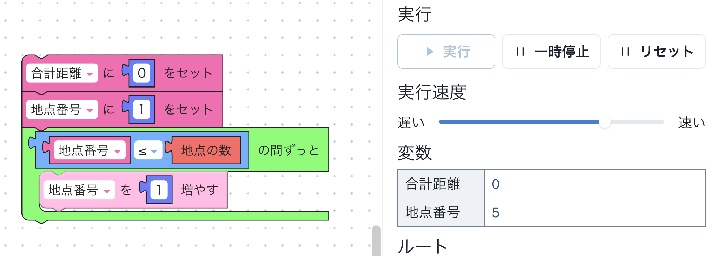

## 3.2. 合計移動距離の短いルートを先頭に並び替えよう

続いて、ルートを移動距離の短いものから順に並び替えていきましょう。「並び替え」の課題を解いていない場合は先に解くことをおすすめします。

前節で定義した変数に加えて「ルート番号」を定義し、1 番目から順番にルートを比べていきましょう。1 番目のルートと 2 番目、2 番目と 3 番目、3 番目と 4 番目といったように、隣同士を比べ、後ろのルートのほうが前のルートより短ければ、前後を入れ替えていきます。

もっとも手数がかかる場合、一番下のルートを一番上まで持ってこなければなりませんから、これをルートの個数分だけ繰り返せば完了です。


### 3.3. 5 番目より長いルートを削除しよう

ルートを短い順に並び替え終えたら、上位 5 つだけを残して、それ以降は削除しましょう。これにより、自然選択が実装できました。

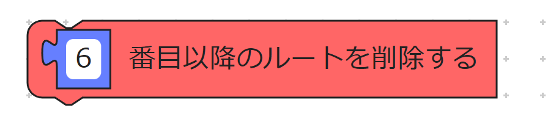

## 3. 新しい世代を誕生させよう

前章のプログラムにより、遺伝子の数は 10 個から 5 個まで減ってしまいました。残った遺伝子から、新たな世代を誕生させていきましょう。新しい世代を誕生させるには、「交叉」と「突然変異」の方法があるのでした。

### 3.1. 交叉

交叉では、2 つの遺伝子を組み合わせ、新しい遺伝子を作り出します。これには様々な方法が考えられますが、ここでは次のような方法を考えます。

1. 新しい空のルートを作ります
2. 親となるルートを 2 つ選びます
3. 親 2 つのルートから、どちらか一つをランダムに選びます
4. 選ばれた親のルートで訪れる地点を先頭から順番に見ていき、まだ新しいルートで訪れていない地点が見つかれば新しいルートに追加します
5. 3 ～ 4 を繰り返します

例を見てみましょう。


親が「B → D → E → C → A」「A → D → B → E → C」の 2 つで、この結果「B → D → A → E → C」が次の子になるとします。このとき起きていることは次の通りです。

1. 最初に親 1 が選ばれ、先頭の B 地点が子に追加される
2. 次にもう一度親 1 が選ばれ、次の D 地点が子に追加される
3. 次は親 2 が選ばれ、先頭の A 地点が子に追加される
4. もう一度親 2 が選ばれるが、D や B 地点はすでに子に存在しているので無視され、その次の E 地点が子に追加される
5. 最後は親 1 が選ばれるが、E 地点はすでに子に存在しているので、その次の C 地点が子に追加される

ランダムに親を選ぶためには、「～ 以上 ～ 以下のランダムな整数」ブロックを利用します。このブロックを用いると、ブロックが実行されるたびに指定された範囲からランダムに取り出した値が得られます。例えば、下の図のブロックでは、1 または 2 のうちのどちらかが得られます。

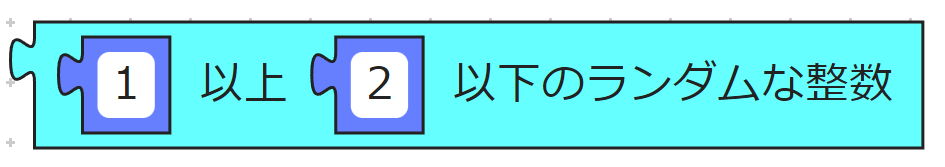

新しいルートを作成するためには、「新しいルートを作成」ブロックを用います。これにより作られたルートは一番最後に追加されますので、そのルート番号はその時点でのルートの数に一致します。ですので、新しくルートを追加した後、そのルートに地点を追加するためには「現在のルートの数」ブロックが利用できます。

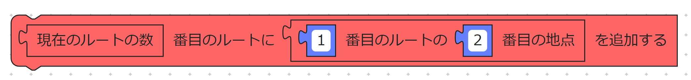

### 3.2. 突然変異

交叉が終わった後、必要に応じて遺伝子を突然変異させましょう。交叉と同じく、突然変異にも様々な方法が考えられますが、最も簡単なのは、通る地点の一部を入れ替えることです。

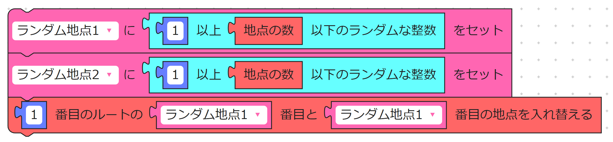

## 4. おわりに

2 章と 3 章のステップを繰り返し続けることにより、プログラムは徐々に答えに近づきます。ただ、思ったように良い結果が出てこないかもしれません。その場合、「上位 5 つだけを残す」や「新しく 5 つの遺伝子を作る」における「5」などの数字を切り替えたり、プログラムを書き換えるなどして試行錯誤してみましょう。
