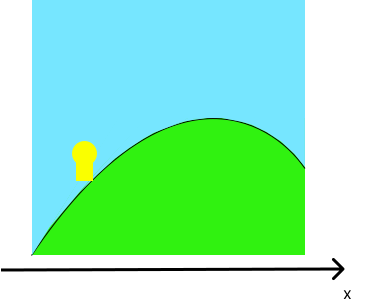
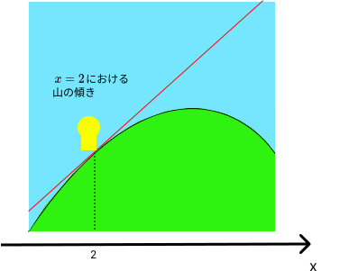
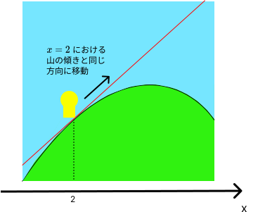

# 勾配降下法

## 勾配降下法とは
勾配降下法は、現代の機械学習でもっともよく用いられる学習方法の1つです。
この課題では山登りを行うアルゴリズムを通して勾配降下法の考え方を学びましょう。

## 簡単な場合の山登り
### 1次元の山
まずは1次元の簡単な山を考えてみます。つまり、単純に横に伸びたような山を上ります。
位置を $x$ で表すことにします。ある位置から始めて、山の頂点にたどり着くことを目指しましょう。  

### 山の傾き
今 $x$ の値が $2$ であり、このときの高さが $10$ であるとします。
このとき位置 $x$ をどのように変化させれば高さを上げられるでしょうか。
もちろん今持っている「 $x=2$ の時の高さが $10$ 」という情報だけではわかりません。
$x=2$ の前後で山の高さがどのように変化するかを調べる必要があります。この変化の割合を「 $x=2$ における山の傾き」と呼ぶことにします。  
ある点 $x=a$ における山の傾きは、非常に小さな値 $h$ を用いて次のような式で求まります。 

$$
  \text{(点aにおける山の傾き)} = \dfrac{(点x=a+hにおける高さ) - (点x=aにおける高さ)}{h}
$$ 

この式を使って $x=2$ における山の傾きを求めてみましょう。$h$ は小さな値にするので、例えば $0.01$ とします。すると、 $x=2$ における傾きは、 

$$
  \dfrac{(点x=2+0.01における高さ) - (点x=2における高さ)}{0.01} = \dfrac{(点x=2.01における高さ) - 10}{0.01}
$$ 

となります。 このとき点　$x=2.01$ における高さを調べる必要がありますが、仮にこれが $10.02$ とわかったとすると、傾きは

$$
  \dfrac{10.02 - 10}{0.01} = 2
$$ 

となります。さてこの結果から、高さは $x=2$ の前後で $x$ の変化に対し2倍ほどの割合で増加することがわかります。  

### どのように移動するか
このとき、 $x$ をどのように変化させれば高さを上げられるでしょうか。少し考えてみると、 $x$ を大きくすればよさそうなことに気づきます(逆に $x$ を小さくすれば高さは下がります)。もし傾きが $-2$ などの負の値だったとすると、 $x$ を小さくすることで高さは上がると考えられます。つまり、傾きの方向(符号)と同じ向きに $x$ を変化させればよいです。またその時の変化させる量についてですが、これは傾きの大きさに応じて変化させる必要があるでしょう。つまり、傾きが大きいときは $x$ を大きく変化させ、傾きが小さいときは $x$ を小さく変化させるようにします。そこで、傾きを $k$ として、 

$$
  x \leftarrow x + k
$$ 

のように $x$ の値を変化させるようにします。こうすることで傾きの方向とは逆向きに $x$ を変化させつつ、その変化量は傾きの大小に応じて変えることができます。実際には、傾き $k$ の値をそのまま用いずに、学習率と呼ばれる $\alpha$ という値を用いて 

$$
  x \leftarrow x + \alpha k
$$

のようにすることが多いです。$\alpha$ は例えば $0.1$ などの値に設定します。長くなりましたが、結局のところ $x=2$ で傾きが $2$ だったので、 $x$ の値を $2 + 0.1 \cdot 2=2.2$ などと変化させることで高さを上げることができます(学習率を $0.1$ としました)。 

 

### 繰り返して頂上を目指す
もっとも高くなるような点を求めるためには、以上のステップを繰り返していけばよいです。つまり、新たに求まった $x=2.2$ という値に対し、再びその点における山の傾きを求め、その傾きに応じて $x$ の値を変化させて、また傾きを求め $\cdots$ ということを繰り返します。山の形にもよりますが、もし単純な形であれば、このステップを繰り返していくうちにいずれ傾きは小さくなっていき、したがってだんだん $x$ の値が変化しなくなっていきます。このとき位置 $x$ が山の頂上になります。

## 本格的な山登り
### 2次元の山
先ほどは、横に伸びた山を上りましたが、今度は本格的な山登りをすることを考えましょう。つまり、横だけでなく縦にも伸びた2次元の山を登ります。今、あなたはとある山のどこかに降ろされたとします。あなたに与えられたミッションは、山頂にたどり着くようなアルゴリズムを考えることです。ただし、ただ1つの山の頂上に着くだけではだめで、山のどんな位置に降ろされたとしても山頂にたどり着けるようにしなければいけません。以下、位置は $(x,y)$ のように表すことにします。
### 1次元の山の場合の応用
このミッションは、基本的には先ほどの1次元の山における考え方を応用することで達成することができます。2変数関数の場合、傾きというのはどのように考えればよいかというと、 $x$ 軸方向と $y$ 軸方向それぞれの傾きを求めればよいです。例えば、点 $(a,b)$ における $x$ 軸方向の傾きは、 

$$
  \dfrac{(点(a+h, b)における高さ) - (点(a, b)における高さ)}{h}
$$ 

のように求められます。つまり、 $y$ 軸方向は固定して、 $x$ のみをわずかに変化させることで $x$ 軸方向の傾きを求められます。 $y$ 軸方向についても同様です。  
それぞれの傾きが求まったら、位置をどのように更新すれば高さを大きくすることができるでしょうか。考えてみましょう。考えたら、そのアルゴリズムをブロックを組み合わせて実現し、山登りミッションを達成しましょう。  

## ブロックの使用方法
この課題特有のブロックの使用方法について説明します。  
- x ブロック  
    
  現在の $x$ の値を取得します。  
- y ブロック  
    
  現在の $y$ の値を取得します。
- 高さブロック  
    
  指定した座標の高さを取得します。
- x 軸方向に動くブロック  
    
  $x$ 軸方向に指定した値だけ動きます。なお正の値を入れれば $x$ 軸の正の向きに、負の値を入れれば $x$ 軸の負の向きに動きます。
- y 軸方向に動くブロック  
    
  $y$ 軸方向に指定した値だけ動きます。なお正の値を入れれば $y$ 軸の正の向きに、負の値を入れれば $y$ 軸の負の向きに動きます。

## 機械学習における勾配降下法
機械学習では、主に損失関数などと呼ばれる関数の取る値が小さくなるような値を求めるために勾配降下法が用いられます。
今回「傾き」として説明したものは、一般には勾配(1変数関数の場合は導関数や微分係数)と呼ばれます。
また先ほどは山の頂上、つまりもっとも高い点を求めましたが、勾配降下法は実際には最小値を求めるために使います(名前に「降下」とついているのはそれが理由です)。
とはいえ考え方に大きな違いはなく、単に傾きの符号と同じ方向ではなく逆の方向に変化させるというように変わるだけです(山の例でいうと、傾きの符号と逆の方向に移動すれば山を下ることになります)。  
現代の機械学習ではニューラルネットワークと呼ばれるものがよく用いられますが、ニューラルネットワークの学習に用いられるのも基本的には勾配降下法です。勾配降下法にはさまざまな発展があるので、興味のある人は調べてみましょう。
