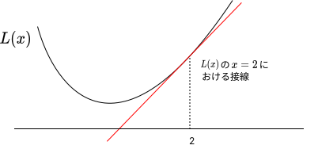
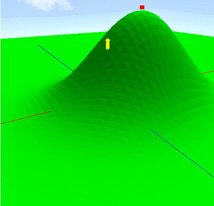
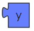

# 勾配降下法

## 勾配降下法とは
勾配降下法は、現代の機械学習でもっともよく用いられる学習方法の1つです。
例えば教師あり学習において、正解データとモデルの出力との「誤差」が最小値をとるような点を探すときに用いられます。この「誤差」はよく損失関数と呼ばれます。
損失関数の「勾配」というものを求め、それを使って損失関数の値を下げていくことから勾配降下法と呼ばれています。

## 勾配降下法の例
例えば、 $x$ を入力として受け取る関数 $L(x)$ を損失関数として、この $L(x)$ の値を小さくすることを考えましょう。
今 $x$ の値が $2$ であり、このとき損失関数の値が $10$ 、つまり $L(2)=10$ であるとします。
このとき $x$ をどのように変化させれば $L(x)$ が小さくなるでしょうか。
もちろん今持っている情報 $L(2)=10$ だけではわかりません。
$x=2$ の前後で $L(x)$ が $x$ に対してどれくらいの割合で変化するかを求めることになります。この変化の割合をわかりやすさのため「 $L(x)$ の $x=2$ における傾き」と呼ぶことにします(高校数学を知っている人なら、$L(x)$ の微分 $L'(x)$ のことだとわかるでしょう)。なおこの傾きが損失関数の勾配にあたります。またこの傾きは実際には接線の傾きになっています。  
ある点 $a$ における $L(x)$ の傾きは、非常に小さな値 $h$ を用いて次のような式で求まります。 

$$
  点x=aにおけるL(x)の傾き = \dfrac{L(a+h) - L(a)}{h}
$$ 

この式を使って $x=2$ における傾きを求めてみましょう。$h$ は小さな値にするので、例えば $0.01$ とします。すると、 $x=2$ における傾きは、 

$$
  \dfrac{L(2+0.01) - L(2)}{0.01} = \dfrac{L(2.01) - L(2)}{0.01}
$$ 

となります。 $L(2)$ の値は知っているので、 $L(2.01)$ の値を調べる必要がありますが、仮にこれが $10.02$ と求まったとすると、傾きは

$$
  \dfrac{10.02 - 10}{0.01} = 2
$$ 

となります。さて、この結果から $L(x)$ は $x=2$ の前後で、 $x$ の変化に対し2倍ほどの割合で増加することがわかります。  
  
このとき、 $x$ をどのように変化させれば $L(x)$ が小さくなるでしょうか。少し考えてみると、 $x$ を小さくすればよさそうなことに気づきます(逆に $x$ を大きくすれば $L(x)$ は大きくなります)。もし傾きが $-2$ などの負の値だったとすると、 $x$ を大きくすることで $L(x)$ は小さくなると考えられます。つまり、傾きの方向(符号)とは逆向きに $x$ を変化させることになります。またその時の変化させる量についてですが、これは傾きの大きさに応じて変化させる必要があるでしょう。つまり、傾きが大きいときは $x$ を大きく変化させ、傾きが小さいときは $x$ を小さく変化させるようにします。そこで、傾きを $k$ として、 

$$
  x \leftarrow x - k
$$ 

のように $x$ の値を変化させるようにします。こうすることで傾きの方向とは逆向きに $x$ を変化させつつ、その変化量は傾きの大小に応じて変えることができます。実際には、傾き $k$ の値をそのまま用いずに、学習率と呼ばれる $\alpha$ という値を用いて 

$$
  x \leftarrow x - \alpha k
$$

のようにすることが多いです。$\alpha$ は例えば $0.1$ などの値に設定します。長くなりましたが、結局のところ $x=2$ で傾きが $2$ だったので、$x$ の値を $2 - 0.1 \cdot 2=2.8$ などと変化させることで $L(x)$ の値を小さくすることができます(学習率を $0.1$ としました)。  
$L(x)$ がもっとも小さくなる点を求めるためには、以上のステップを繰り返していけばよいです。つまり、新たに求まった $x=2.8$ という値に対し、再びその前後の $L(x)$ の傾きを求め、その傾きに応じて $x$ の値を変化させて、また傾きを求め $\cdots$ ということを繰り返します。基本的には(損失関数によりますが)、このステップを繰り返していくうちに、いずれ傾きは小さくなっていき、したがってだんだん $x$ の値が変化しなくなっていきます。このことを収束といい、収束したときの点を勾配降下法の終了地点とみなすのが基本です。この終了地点が損失関数が最小になる点であることが期待されます。

## 山登りをしよう
突然ですが、山登りをすることを考えましょう。今、あなたはとある山の中に降ろされたとします。あなたに与えられたミッションは、山頂にたどり着くようなアルゴリズムを考えることです。ただし、ただ1つの山の頂上に着くだけではだめで、山のどんな位置に降ろされたとしても山頂にたどり着けるようにしなければいけません。  
このミッションは、勾配降下法の考え方を応用することで達成することができます。勾配降下法は、

1. ある点から始めて
2. 損失関数の傾きを求めることで点の位置を更新していき
2. 損失関数の値が最小になる点を求める

ものでした。一方、今回の山登りは

1. 降ろされた点から始めて
2. 山中を移動していき
2. 高さが最大になる点を求める

と表現することができます。これらはよく似ていることがわかるでしょうか。したがって、勾配降下法と同様の考え方を使うことで山登りをすることができます。  
ただ、少し考えてみると、先ほどの例における損失関数 $L(x)$ に関する勾配降下法と、山登りで用いるべきアルゴリズムにはいくつかの違いがあることがわかります。そのひとつは、「高さ」が位置 $(x, y)$ の関数となることです。つまり、変数の数が1つではなく2つになります。そこで、2変数関数 $L(x, y)$ の勾配降下法について見てみましょう。2変数関数の場合、傾きというのはどのように考えればよいかというと、$x$ 軸方向と $y$ 軸方向それぞれの傾きを求めればよいです。例えば、点 $(a,b)$ における $x$ 軸方向の傾きは、 

$$
  \dfrac{L(a+h, b) - L(a, b)}{h}
$$ 

のように求められます。つまり、 $y$ 軸方向は固定して、 $x$ のみをわずかに変化させることで $x$ 軸方向の傾きが求まります。 $y$ 軸方向についても同様です。  
それぞれの傾きが求まったら、位置をどのように更新すれば高さを大きくすることができるでしょうか。考えてみましょう。考えたら、そのアルゴリズムをブロックを組み合わせて実現し、山登りミッションを達成しましょう。  

## ブロックの使用方法
この課題特有のブロックの使用方法について説明します。  
- x ブロック  
    
  現在の $x$ の値を取得します。  
- y ブロック  
    
  現在の $y$ の値を取得します。
- 高さブロック  
    
  指定した座標の高さを取得します。
- x 軸方向に動くブロック  
    
  $x$ 軸方向に指定した値だけ動きます。なお正の値を入れれば $x$ 軸の正の向きに、負の値を入れれば $x$ 軸の負の向きに動きます。
- y 軸方向に動くブロック  
    
  $y$ 軸方向に指定した値だけ動きます。なお正の値を入れれば $y$ 軸の正の向きに、負の値を入れれば $y$ 軸の負の向きに動きます。
