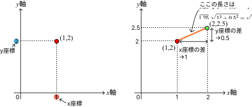
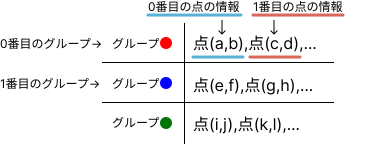
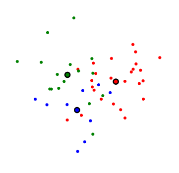
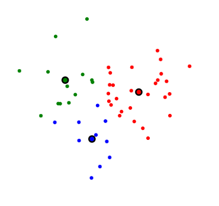
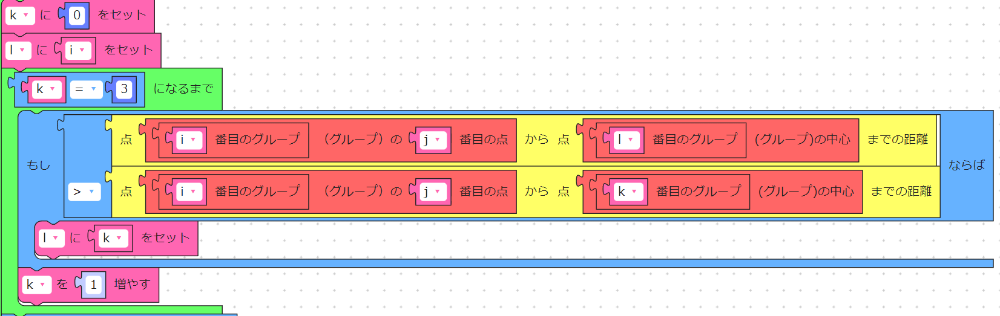
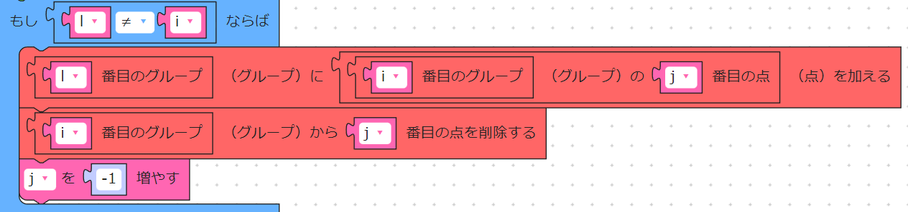
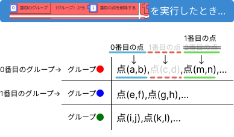
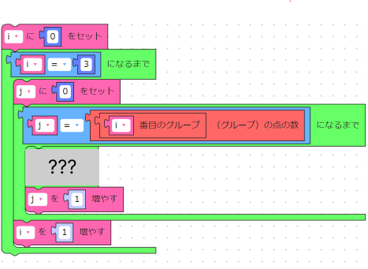

# 1. 課題の概要
この課題ではクラスタリングのアルゴリズムの中でも代表的なK-means法のアルゴリズムを、ブロックプログラミングを用いて作る体験ができます。
## 1.1. クラスタリングとは
機械学習の一種であり、与えられたデータを外的基準なしに自動的に分類することです。
## 1.2. アルゴリズムとは
目的を達成するための計算手順です。例えば、「クラスタリングのアルゴリズム」は、「データ分類をするための計算手順」を意味します。

# 2. K-means法
K-means法のアルゴリズムは以下の通りです。
>1. 各点に適当にグループを割り当てる。
>1. 各グループの中心地点を計算する。
>1. 各点から、すべてのグループの中心地点との距離を計算し、最も距離が近いグループにその点を割り当て直す。
>1. 上記2つを、変化がなくなるまで繰り返す。

この課題では既に1がなされた状態から、2-4番を行うプログラムを書くことが目標です。

# 3. 画面の見方・データ構造
## 3.1. 図の見方
図では座標平面上に点が配置されています。また、点の色はその点が所属するグループを表しています。黒縁のついた点はその点の色のグループの中心地点です。
### 3.1.1. 座標平面について
座標平面では平面上の点の位置を2つの数字を用いて表せます。例えば(1,2)といった形で点を表現できます。図のように座標平面上には「x軸」と「y軸」という2つの基準となる線があります。(1,2)の意味はy軸から1だけ離れていて、x軸から2だけ離れている点という意味です。また、(1,2)の中の左側の数字をx座標(今は1)、右側の数字をy座標(今は2)といいます。

2点間の距離は次の式で計算できます。
√((2点間のx座標の差)2+(2点間の7座標の差)2)

## 3.2. データ構造
この課題では、画像のように各データの情報(座標)がグループごとに順番に並べられて保存されています。グループや点には順番が存在します。グループや点の数え方が「0番目の点,1番目の点…」というように0始まりであることに注意してください。 例えば、画像の点(c,d)(朱色)は「0番目のグループの1番目の点」で表されます。

# 4. データを分類してみよう
画面上のランダムに並ぶ点の色をきれいに揃えてみましょう。

データ仕分け前

データ仕分け後
## 4.1. 一つの点に着目すると...
### 4.1.1. 割り当てるべきグループを求める
一つの点に着目して、その点にしなければならない操作は、2.で見たように、「その点からすべてのグループの中心地点との距離を計算し、最も距離が近いグループにその点を割り当て直す」です。最小値を計算する方法には、一つ新たに変数を用意し、ループの度に起きる比較で、小さい方をその変数に代入し続けることで、最終的に最小値が得られる、という方法があります。
次のようにすると「i番目のグループのj番目の点」に最も中心が近いグループの番号がlに代入されます。つまり、「i番目のグループのj番目の点」は「l番目のグループ」に割り当て直されなければならないことがわかります。

### 4.1.2. 点をグループに割り当てよう
上で求まった、割り当てるグループが、注目している点の属するグループと同じグループである場合、つまり、注目している点の属するグループがその点にとって最適であるとき、割り当て直す必要はありません。
割り当てるグループが注目している点の属するグループと同じグループでないとき、割り当て直さなければなりません。「点AをグループBに割り当てる」には「グループBに点Aを加える」操作と「点Aを点Aの属していたグループから削除する」操作が必要です。次のようにすると「i番目のグループのj番目の点」を「l番目のグループ」に加え、そして「i番目のグループ」から削除することができます。

jを-1しているのは、点を削除する際には図のように点の数え方がずれてしまうためです。 なお、点を追加する際はグループ内の点の並びの末尾に追加されます。

## 4.2. 4.1. をすべての点に対して実行しよう
3.2.のようにこの課題のデータ構造を考慮し、すべての点について処理を行うには以下のようにすると良いでしょう。???の部分に注目している一つの点に対する処理を書くことで、すべての点に対して処理が可能となります。

## 4.3. 忘れずに...
この課題では2.で見たK-meansのアルゴリズムの2.と3.を無限に繰り返すことになります。「ずっと」のブロックを忘れないようにしましょう。
また、中心地点は、3.を行う前に予め計算して置かなければならないので、「中心を計算する」ブロックを適切な箇所に置くことも忘れないようにしましょう。

