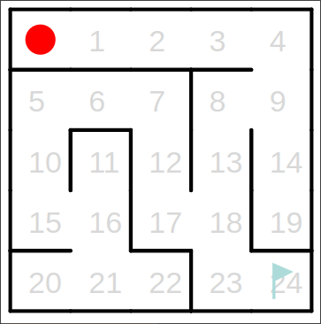

# Q学習
**ヒントも合わせてご参照下さい。**

## 1. Q学習とは
Q学習とは、強化学習のアルゴリズムの一種であり、Q値を学習するためのアルゴリズムです。Q値とは、行動価値を表す値であり、このQ値を適切に更新していくことで、学習が進んでいきます。このリファレンスではQ値のことを評価値と呼んでいきます。このQ学習を用いて、今回は迷路の最短経路を求めてみましょう。

## 2. ブロックの説明

「...の確率で当たった」ブロックは、引数に0~1の数字を受け取り、その数字の確率で真を返します。例えば、0を受け取った場合は常に偽を、1を受け取った場合には常に真を、0.5を受け取った場合には50%の確率で真を返します。

方向を表すブロックです。プルダウンから、左・右・上・下を選択出来ます。

現在迷路上の赤い丸がいる位置の行や列を返すブロックたちです。行・列はそれぞれ0から始まります。例えば数字の8が書いてある場所は、行番号1、列番号3となっています。

「...に壁がある」ブロックは引数に方向を受け取り、その方向に壁があるかどうかを真偽値で返します。

このブロックは、迷路上の赤い丸がゴール(右下、旗が書かれている部分)にいるかどうかを真偽値で返します。

このブロックは、引数に方向を取り、その方向に移動します。ただし、移動方向に壁がある時はエラーとなってしまうので、壁があるかどうかを「...に壁がある」ブロックで確認しましょう。

均等な確率で上下左右のいずれかが返ってきます。

スタート地点に移動します。「現在位置がゴール」ブロックを使い、ゴールにたどり着いたらスタートに戻るようなプログラムをかくことが出来ます。

評価値(Q値、行動価値)を返します。１つ目の引数には**状態**を表す整数値が入ります。今回の迷路探索の場合は、状態は現在位置、ということになります。現在位置を整数値で表現するには、「現在位置の行」・「現在位置の列」ブロックを用いて、現在赤い丸がいる場所の迷路上の数字と一致するように状態を作っていきましょう。２つ目の引数は方向が入ります。

評価値を更新します。１つ目、２つ目の引数については「...から...に動く時の評価値」ブロックと同じです。３つ目の引数には更新する値(整数)を渡します。

## 3. 処理全体の概要
まず、ゴール回数を記録します。一回ゴールするたびに1ずつ増やします。

その後、迷路上の赤い丸がゴールに達するまで、次の処理を繰り返します。

1. 上下左右のどの方向に移動するかを決め、その方向に可能であれば移動する。
2. 適切な報酬を設定する
3. 移動後(壁があって実際には移動していない場合も含む)の、最適な移動方向を求める。
4. 移動前の赤い丸の居た場所の状態から、移動した方向へ移動する時の評価値を更新する。

そして、ゴールにたどり着いたら、再びスタートに戻り、ゴール回数を1増やします。これを繰り返します。次に、上記1, 2, 3, 4についてより詳しく解説していきます。

### 3.1
移動方向は、